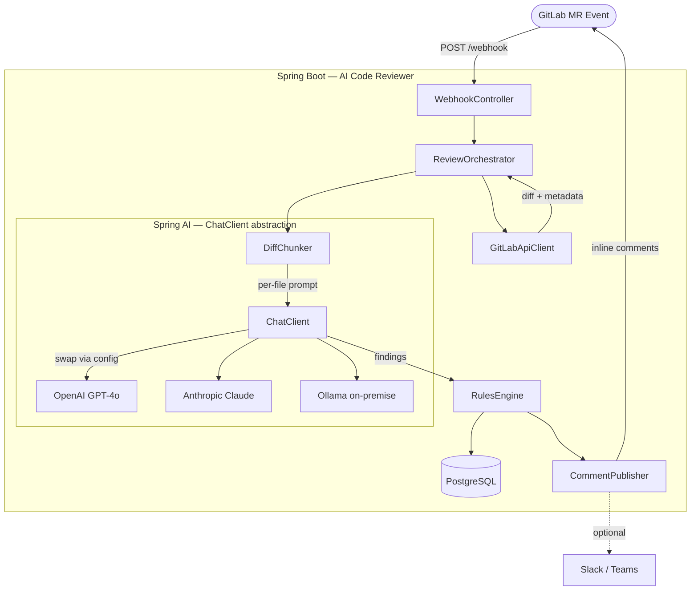

# AI Code Reviewer

An AI-powered code review system for GitLab Merge Requests. Analyses every MR diff against security, performance, SOLID principles, and correctness, then posts findings as inline comments directly on the changed lines.

---

## Status

| Stream | Version | State |
|---|---|---|
| MVP (Python CI script) | v1.2 | ✅ Deployed & hardened (PR #4 applied) |
| Spring AI Microservice | v0.9 | 🟢 Running locally — core review loop working, feature branch `feat/tool-calling-context` |

**Current active branch:** `feat/tool-calling-context`  
**Pending before merge:** A/B comparison of none/injected/script modes on same MR (Task #10).

---

## How it works

```
GitLab MR Event
      │
      ▼ (webhook or CI pipeline trigger)
AI Code Reviewer
      │
      ├─► Fetch diff from GitLab API
      ├─► Split diff by file
      ├─► Send each file chunk to LLM
      │         └─ OpenAI / Anthropic / Ollama (swappable)
      ├─► Filter findings by severity
      ├─► Post summary comment
      └─► Post inline comments on MR
```

---

## Architecture overview



---

## Documentation

| Document | Description |
|---|---|
| [Project Plan](docs/PROJECT_PLAN.md) | Phases, milestones, timeline, and success metrics |
| [Technical Specification](docs/TECHNICAL_SPECIFICATION.md) | Functional & non-functional requirements, API contracts, data models |
| [Architecture](docs/ARCHITECTURE.md) | Component breakdown, data flow, deployment, technology decisions |
| [MVP Spec](docs/MVP_SPEC.md) | Current Python CI script: how to configure and run |
| [ADR-001 Technology Choice](docs/adr/ADR-001-technology-choice.md) | Why Spring AI microservice over Python script |
| [ADR-002 Model Selection](docs/adr/ADR-002-model-selection.md) | Why Gemini Flash / Qwen2.5-Coder as default models |
| [ADR-003 Comment Strategy](docs/adr/ADR-003-comment-strategy.md) | Inline-first with general comment fallback |
| [Strategy Comparison Report](docs/COMPARISON_REPORT.md) | none vs injected vs Python script on same MR — data and verdict |

---

## Quick start (MVP)

**Prerequisites:** GitLab CI, an OpenRouter API key, Python 3.11+.

1. Add CI variables to your GitLab project:

```
GITLAB_TOKEN     = <project access token with api scope>
AI_API_KEY       = <OpenRouter or provider API key>
AI_MODEL         = google/gemini-2.0-flash-001
REQUESTS_CA_BUNDLE = /etc/ssl/certs/ca-certificates.crt
MIN_SEVERITY     = Low
```

2. Copy `.gitlab-ci.yml` trigger job from [MVP Spec](docs/MVP_SPEC.md).

3. Open a Merge Request — the reviewer runs automatically.

---

## Technology stack

| Layer | MVP (Python) | Microservice (Java) |
|---|---|---|
| Language | Python 3.11 | Java 21 |
| Framework | — | Spring Boot 3.5 + Spring AI 1.1.7 |
| Trigger | GitLab CI pipeline | GitLab Webhook (event-differentiated) |
| AI providers | Anthropic Claude Haiku (native) | Spring AI ChatClient (Anthropic / OpenAI / Ollama) |
| Context strategy | Diff only | Configurable: `none` / `injected` / `agentic` |
| Token auditing | None | Per-call, persisted to DB + Micrometer metric |
| Storage | None | PostgreSQL (`mr_reviews`, `findings`) |
| Notifications | GitLab inline + fallback comments | Same |

---

## Contributing

See [Technical Specification](docs/TECHNICAL_SPECIFICATION.md) for coding conventions and contribution guidelines.
