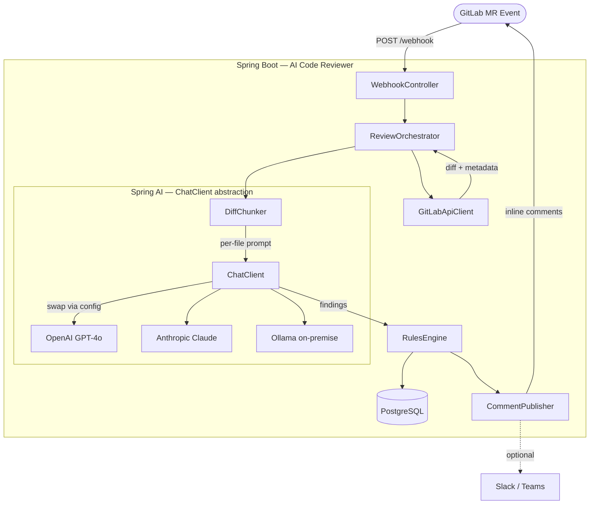

# Architecture — AI Code Reviewer

**Version:** 1.1  
**Author:** Engineering Team  
**Last updated:** June 2026  
**Status:** Reflects built state (feat/tool-calling-context branch)

---

## 1. Architecture overview

The system has two distinct deployment states: the Phase 1 Python CI script (running today) and the Phase 2 Spring AI microservice (target architecture). Both states share the same logical flow: receive a GitLab MR event, fetch the diff, analyse it with an LLM, and post findings back.

---

## 2. Current state — Phase 1 (Python CI script)

```
Developer pushes to MR branch
        │
        ▼
GitLab CI Pipeline triggered
        │
        ▼
  ┌─────────────────────────┐
  │  Python script           │
  │                          │
  │  1. GET /mr/changes      │──► GitLab API
  │  2. GET /mr/versions     │
  │  3. Split diff by file   │
  │  4. POST to LLM          │──► OpenRouter → LLM
  │  5. Parse JSON response  │
  │  6. DELETE old notes     │──► GitLab API
  │  7. POST summary note    │──► GitLab API
  │  8. POST inline comments │──► GitLab API
  └─────────────────────────┘
```

**Limitations of current state:**
- Review is blocking — delays the pipeline
- No persistence — no history or trending
- No configuration UI
- No webhook — only triggered by pipeline run, not on MR open
- Single Python script with no tests or separation of concerns

---

## 3. Target state — Phase 2 (Spring AI microservice)



---

## 4. Component breakdown

### 4.1 WebhookController

- **Layer:** Presentation (Spring MVC `@RestController`)
- **Responsibility:** Accept `POST /api/v1/webhook` from GitLab, verify the `X-Gitlab-Token` header, parse the event payload, and dispatch to `ReviewOrchestrator` asynchronously.
- **Key decisions:** Async dispatch via `@Async` so the endpoint returns `202 Accepted` immediately. GitLab expects a fast acknowledgement; the review happens in the background.

**Event differentiation logic** (GitLab cannot sub-filter MR actions — the controller does it):

```
POST /api/v1/webhook
        │
        ├── Validate X-Gitlab-Token          ──► 401 if invalid
        ├── Check X-Gitlab-Event header      ──► 200 if not "Merge Request Hook"
        ├── Read object_attributes.action:
        │       open / reopen                ──► review (MR created or reopened)
        │       update + oldrev present      ──► review (new commits pushed)
        │       update + no oldrev           ──► 200 skip (label/desc/assignee edit)
        │       close / merge / other        ──► 200 skip
        └── dispatch(mrEvent)                ──► 202 Accepted (async)
```

`oldrev` in the GitLab payload is set **only** when the `update` event carried new commits. This also eliminates the spurious trailing `update` GitLab fires right after `open` (no `oldrev` → skipped).

### 4.2 ReviewOrchestrator

- **Layer:** Application service (`@Service`)
- **Responsibility:** Coordinates the full review workflow. Orchestrates calls to `GitLabApiClient`, `DiffChunker`, `LlmReviewService`, `RulesEngine`, and `CommentPublisher`.
- **Key decisions:** Each file is reviewed independently in sequence. A failure on one file logs a warning and continues to the next (partial review preferred over total failure).

### 4.3 GitLabApiClient

- **Layer:** Infrastructure (`@Component`)
- **Responsibility:** All outbound HTTP calls to the GitLab API. Encapsulates retry logic (via Spring Retry `@Retryable`) and error mapping.
- **Key decisions:** Uses Spring's `RestClient` (not RestTemplate). Dedicated `@Configuration` class wires the client with base URL, auth header, and timeout.

### 4.4 DiffChunker

- **Layer:** Domain service (`@Component`)
- **Responsibility:** Parses the raw GitLab diff response into per-file chunks. For each file, extracts the `ValidLineMap` (a `Map<String, List<Integer>>`) by parsing `@@` hunk headers. Filters ignored extensions.
- **Output:** `List<FileChunk>` — each containing the file path, diff text, and list of valid new-file line numbers.

```java
public record FileChunk(
    String filePath,
    String diffText,
    List<Integer> validLines
) {}
```

### 4.5 LlmReviewService (Spring AI ChatClient)

- **Layer:** Infrastructure / AI gateway (`@Service`)
- **Responsibility:** Wraps Spring AI's `ChatClient` to send a `FileChunk` to the configured LLM and receive `FileReviewResult` (findings + token usage) back.
- **Key decisions:**
  - Uses `ChatClient.Builder` injected by Spring AI auto-configuration — provider is config-only.
  - Non-tool path: `.responseEntity(ReviewResponse.class)` for structured output + access to `ChatResponse` metadata.
  - Tool path: `.chatResponse()` + lenient JSON parse (strips fences, extracts first `{..}` block).
  - `@Retryable` with `noRetryFor = IllegalStateException.class` so parse failures don't retry.
  - Token usage extracted from `ChatResponse.getMetadata().getUsage()` — provider-agnostic.

### 4.5a ContextStrategy — configurable repo context

Three strategies selected via `CONTEXT_STRATEGY` environment variable (or `reviewer.context.strategy` in yml):

| Strategy | What the model sees | Use case |
|---|---|---|
| `none` (default) | Diff only | Baseline; lowest token cost |
| `injected` | Diff + full file at `head_commit_sha` | Deterministic floor; any model; catches issues the diff doesn't show |
| `agentic` | Diff + `@Tool` methods the model can call | Highest potential coverage; requires a tool-capable model |

```
ContextStrategyFactory.create(MrContext)
    │
    ├── "injected" → InjectedStrategy(gitlab, ctx, maxLines)
    │       injectedContextFor(chunk): fetchFileAtRef(sha) → truncate → prepend
    │
    ├── "agentic" → AgenticStrategy(RepoContextTools)
    │       tools(): returns RepoContextTools with getFile / lookupSymbol @Tool methods
    │       budget: CONTEXT_AGENTIC_BUDGET calls per review (default 6)
    │
    └── "none"    → NoneStrategy.INSTANCE (no-op)
```

**Path encoding note:** `fetchFileAtRef` builds a `URI` object (not a template string) to prevent RestClient from double-encoding `%2F` → `%252F` (which GitLab 404s on).

### 4.5b Token usage auditing

Every LLM call records `LlmUsage(promptTokens, completionTokens, totalTokens)` from `ChatResponse.getMetadata().getUsage()`. Accumulated across files via `LlmUsage.add()` and:
- Persisted to `mr_reviews.prompt_tokens / completion_tokens / total_tokens`
- Published as `reviewer.llm.tokens.total` Micrometer counter (tags: `prompt`, `completion`)
- Logged at INFO: `"Review complete — mrIid=X findings=Y tokens(p/c/t)=P/C/T duration=Zms"`

Purpose: enables empirical comparison across strategies and script vs microservice modes.

### 4.6 RulesEngine

- **Layer:** Domain service (`@Component`)
- **Responsibility:** Applies company-specific filtering rules to the raw LLM findings. Current rules: severity threshold filter, deduplication against existing notes, file path allowlist/denylist.
- **Future extension point:** Load rules from database or YAML file without code changes.

### 4.7 CommentPublisher

- **Layer:** Infrastructure (`@Component`)
- **Responsibility:** Posts findings back to GitLab. Attempts inline comment first; falls back to general comment on failure. Posts summary comment first, then individual findings.
- **Key decisions:** Deduplication — fetches and deletes existing AI review notes before posting. Inline failure handling — snaps to nearest valid line from `ValidLineMap` before falling back.

### 4.8 ReviewRepository / FindingRepository

- **Layer:** Infrastructure (Spring Data JPA `@Repository`)
- **Responsibility:** Persist review sessions and individual findings to PostgreSQL.

---

## 5. Data flow

```
1. GitLab fires webhook → WebhookController validates & queues
2. ReviewOrchestrator.run(mrEvent):
   a. GitLabApiClient.fetchDiff(projectId, mrIid)          → RawDiff
   b. GitLabApiClient.fetchVersions(projectId, mrIid)      → CommitShas
   c. DiffChunker.split(rawDiff)                           → List<FileChunk>
   d. For each FileChunk:
      LlmReviewService.review(chunk, mrContext)            → List<Finding>
   e. RulesEngine.filter(allFindings, config)              → List<Finding>
   f. ReviewRepository.save(reviewSession)
   g. CommentPublisher.deleteStaleNotes(projectId, mrIid)
   h. CommentPublisher.postSummary(findings)
   i. For each Finding:
      CommentPublisher.postInline(finding, commitShas)
        → if 201: FindingRepository.save(finding, posted_inline=true)
        → if !201: add to fallback list
   j. If fallback list non-empty:
      CommentPublisher.postFallbackComment(fallbackFindings)
```

---

## 6. Spring AI provider abstraction

The key architectural advantage of Spring AI is that `ChatClient` is provider-agnostic. Switching from OpenAI to Anthropic or an on-premise Ollama instance requires only a configuration change:

```yaml
# Profile: openai (default)
spring.ai.openai.api-key: ${OPENAI_API_KEY}
spring.ai.openai.chat.options.model: gpt-4o-mini

# Profile: anthropic
spring.ai.anthropic.api-key: ${ANTHROPIC_API_KEY}
spring.ai.anthropic.chat.options.model: claude-haiku-4-5

# Profile: ollama (on-premise, no data leaves the network)
spring.ai.ollama.base-url: http://ollama.internal:11434
spring.ai.ollama.chat.options.model: qwen2.5-coder:32b
```

The `LlmReviewService` is never aware of which provider is active. This is the talking point for data privacy: sensitive repositories can be reviewed by Ollama without any code leaving the corporate network.

---

## 7. Deployment architecture

### 7.1 Local development

```
docker-compose.yml:
  ├── ai-reviewer (Spring Boot app)
  ├── postgres:16
  └── (optional) ollama
```

### 7.2 Production (Kubernetes)

```
Namespace: ai-tools
  ├── Deployment: ai-reviewer
  │     replicas: 2
  │     image: registry.example.com/ai-reviewer:2.0.0
  │     env from: Secret/ai-reviewer-secrets
  │               ConfigMap/ai-reviewer-config
  ├── Service: ai-reviewer (ClusterIP)
  ├── Ingress: ai-reviewer → /api/v1/webhook
  ├── Secret: ai-reviewer-secrets
  │     (GITLAB_TOKEN, OPENAI_API_KEY, GITLAB_WEBHOOK_SECRET, DB_PASS)
  └── CronJob: (future) nightly analytics aggregation
```

### 7.3 Network requirements

| Direction | From | To | Port | Purpose |
|---|---|---|---|---|
| Inbound | GitLab | ai-reviewer Ingress | 443 | Webhook POST |
| Outbound | ai-reviewer | GitLab API | 443 | Fetch diff, post comments |
| Outbound | ai-reviewer | LLM provider API | 443 | Send prompts |
| Outbound | ai-reviewer | PostgreSQL | 5432 | Persistence |
| Outbound | ai-reviewer | Ollama (optional) | 11434 | On-premise LLM |

---

## 8. Technology stack

| Component | Technology | Version | Rationale |
|---|---|---|---|
| Language | Java | 21 | Virtual threads, records, pattern matching; team standard |
| Framework | Spring Boot | 3.5.x | Current stable; Spring AI 1.x compatible |
| AI abstraction | Spring AI | 1.1.7 | Provider-agnostic ChatClient; upgrade path to 2.0 when stable |
| HTTP server | Spring MVC | (included) | Familiar, well-tested |
| HTTP client | Spring RestClient | (included) | Modern replacement for RestTemplate |
| Database | PostgreSQL | 16 | Reliable, JSON support for flexible finding storage |
| ORM | Spring Data JPA | (included) | Hibernate 7 under Spring Boot 4 |
| Metrics | Micrometer + Prometheus | (included) | Standard observability |
| Retry | Spring Retry | 2.x | `@Retryable` on LLM calls |
| Testing | JUnit 5, Testcontainers, WireMock | Latest | Integration testing without external dependencies |
| Container | Docker | 25+ | Standard deployment unit |
| Orchestration | Kubernetes | 1.30+ | Production deployment |

---

## 9. Observability

### Metrics (Micrometer)

| Metric | Type | Description |
|---|---|---|
| `reviewer.mr.processed.total` | Counter | Total MRs reviewed |
| `reviewer.mr.review.duration` | Timer | End-to-end review duration |
| `reviewer.finding.total` | Counter | Findings by severity (tag: `severity`) |
| `reviewer.comment.inline.success` | Counter | Successfully posted inline comments |
| `reviewer.comment.inline.fallback` | Counter | Fell back to general comment |
| `reviewer.llm.request.duration` | Timer | LLM API call duration by provider (tag: `provider`) |
| `reviewer.llm.error.total` | Counter | LLM API errors by type |
| `reviewer.llm.tokens.total` | Counter | Token consumption per review (tags: `prompt`, `completion`) |

### Logging

- `INFO`: MR review started/completed, finding counts, comment posted
- `WARN`: Inline comment failed (with file and line), LLM retry
- `ERROR`: LLM exhausted retries, GitLab API failure, webhook signature mismatch
- `DEBUG`: Full diff sent to LLM, raw LLM response

---

## 10. Key architectural decisions

See the Architecture Decision Records for detailed rationale:

| ADR | Decision |
|---|---|
| [ADR-001](adr/ADR-001-technology-choice.md) | Spring AI microservice as target over expanding the Python script |
| [ADR-002](adr/ADR-002-model-selection.md) | Gemini Flash / Qwen2.5-Coder as default models |
| [ADR-003](adr/ADR-003-comment-strategy.md) | Inline-first with general comment fallback |
